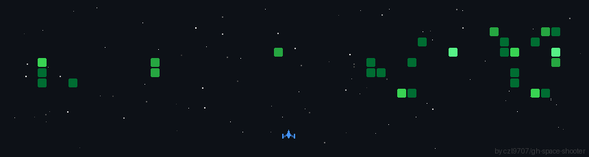

  
  <h1>👨‍💻 What's goood, I'm Hùng 🥸</h1>

### 🛠 My Tech Stack

| Category             | Tools & Technologies                                                                                                                                                                                                                                                                                                |
| :------------------- | :------------------------------------------------------------------------------------------------------------------------------------------------------------------------------------------------------------------------------------------------------------------------------------------------------------------ |
| **Languages**        |                                                                                                               |
| **Data Engineering** |    |
| **Cloud (GCP)**      |                                                                                                     |
| **Databases**        |                                                                                              |
| **DevOps & Tools**   |                                                      |

---

### 📊 My GitHub Stats

  
  

  

---

### 🔥 What I'm working on

- 🏗️ Currently building a **Scalable Data Pipeline** for E-commerce Analytics (Glamira Project).
- ☁️ Exploring **Google Cloud Platform** deep-dives (Dataflow, Pub/Sub).
- 📈 Mastering **dbt** for advanced data modeling.

---

### 📫 Let's Connect!

  

---

 
  

---

<table align="center">
  <tr>
    <td align="center">
      <h3>CURRENTLY UNEMPLOYED</h3>
      
    </td>
    <td align="center">
      <h3>VIETTEL PLEASE HIRE ME</h3>
      
    </td>
  </tr>
</table>
